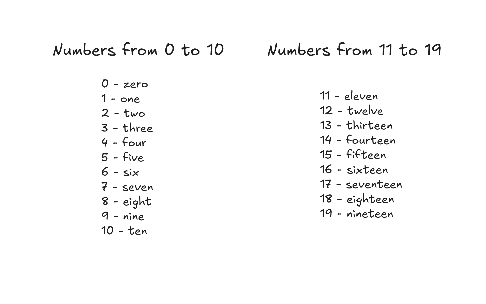
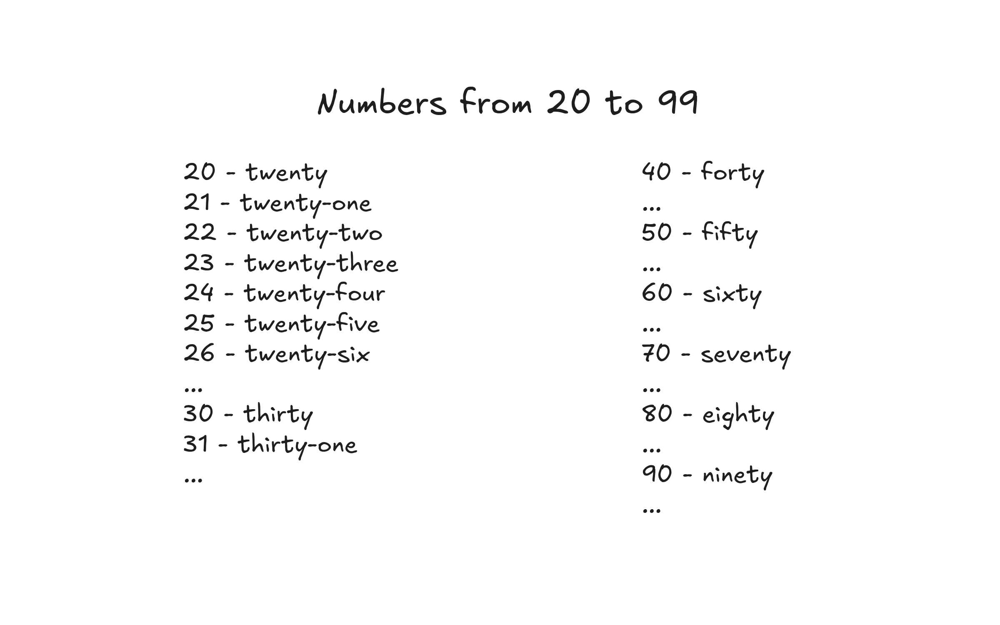
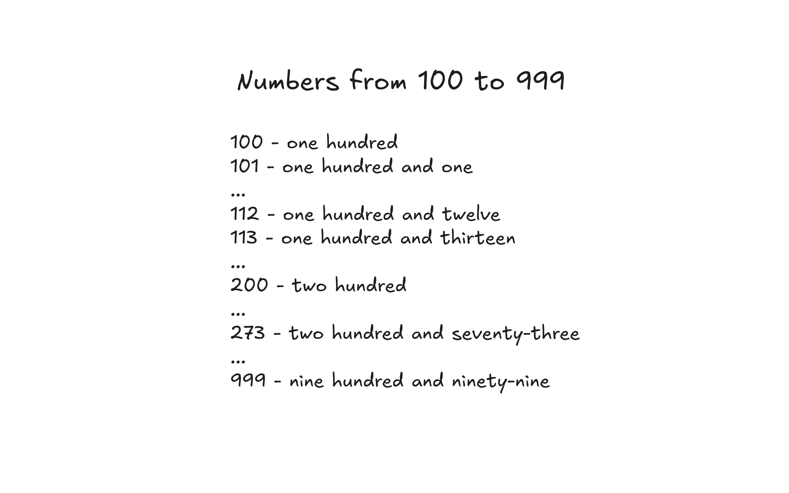
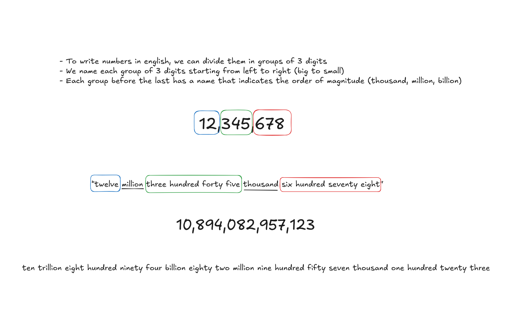

# Trellis Law - Technical test

This project is part of the hiring process for Trellis Law. The goal was to build a full-stack application that allows users to send an integer and receive the number written in English.

## Table of contents

- [Running the apps](#running-the-apps)
  - [Running the whole app with docker-compose](#running-the-whole-app-with-docker-compose)
  - [Running the backend](#running-the-backend)
  - [Running the frontend](#running-the-frontend)
- [Algorithm](#algorithm)
  - [Numbers from 0 to 19](#numbers-from-0-to-19)
  - [Numbers from 20 to 99](#numbers-from-20-to-99)
  - [Numbers from 100 to 999](#numbers-from-100-to-999)
  - [Numbers 1000 and above](#numbers-1000-and-above)
  - [Edge cases](#edge-cases)
- [Architecture](#architecture)
  - [Backend](#backend)
  - [Frontend](#frontend)
- [Testing](#testing)
  - [Backend tests](#backend-tests)
  - [Frontend tests](#frontend-tests)
  - [End-to-end tests](#end-to-end-tests)

## Running the apps

You can run each app separately or run the whole app with docker-compose.

### Running the whole app with docker-compose

To see the whole application (frontend and backend) running together, you can use docker-compose.

```bash
# Make sure you're in the root folder of the project and run the following command
docker-compose up -d
```

By default, the frontend runs in port `5173` and the backend runs in port `8000`.

### Running the backend

#### With Docker

```bash
# Navigate to the backend folder
cd trellis_law_test_backend

# Build the Docker image
docker build -t trellis-law-test-backend .

# Run the Docker container
docker run -d --name trellis-law-test-backend -p 8000:8000 trellis-law-test-backend
```

#### Without Docker

For running the backend without Docker, it is recommended to use a virtual environment and Python version 3.12.8.

1. Create a virtual environment:

```bash
# Navigate to the backend folder
cd trellis_law_test_backend

# Create a virtual environment
python3 -m venv venv

# Activate the virtual environment
source venv/bin/activate

# Install the dependencies
pip install -r requirements.txt

# Run the application
python manage.py runserver
```

By default, the backend runs in port `8000`.

### Running the frontend

#### With Docker

```bash
# Navigate to the frontend folder
cd trellis-law-test-frontend

# Build the Docker image

docker build -t trellis-law-test-frontend .

# Run the Docker container
docker run -d --name trellis-law-test-frontend -p 5173:5173 trellis-law-test-frontend
```

#### Without Docker

For running the frontend without Docker , you need to have Node.js installed (I used node 23.8.0).

```bash
# Navigate to the frontend folder
cd trellis-law-test-frontend

# Install the dependencies
npm install

# Run the application
npm run dev
```

By default, the frontend runs in port `5173`.

## Algorithm

I decided to start the application with the domain, the algorithm that writes numbers in English. This section describes the thought process to solve the problem.

I broke the problem down into a few different cases and implemented them one by one while writing unit tests. The cases are:


### Numbers from 0 to 19

This part is the most simple. I just returned the hardcoded values for each number from 0 to 19.



### Numbers from 20 to 99

For numbers from 20 to 99, I divided the number into two parts: the tens and the units. I then returned the English word for the tens and the units concatenated with a hyphen.



### Numbers from 100 to 999

For numbers from 100 to 999, I divided the number between the hundreds and the rest. I then returned the English word for the hundreds and the rest concatenated with the word "hundred".

> The word "and" is added between the hundreds and the rest when the rest is not zero.



### Numbers 1000 and above

For numbers 1000 and above, I did the following:

1. Broke the number into groups of 3 digits and added them to a stack.
2. Then, I started popping the stack and writing the English word for each group + its order of magnitude (thousand, million, billion...).



## Edge cases

Other than that, I added validations so that the input number was an integer between 0 and 999999999999999.

## Architecture

The application is divided into two parts: the backend and the frontend.

### Backend

The backend is a REST API built with Django and Django Rest Framework. It provides two endpoints:

- **GET** `/num_in_english/?number={number}` - Returns the number written in English.
- **POST** `/num_in_english/` - Receives a number in the request body and returns the number written in English with a five-second delay.

For the backend tech stack, I used **Django, Django Rest Framework, and pytest**.

### Frontend

The frontend is a Vue.js application that allows the user to input a number, choose the HTTP method (GET or POST) and see the number written in English.

For the frontend tech stack, I used **Vue.js, Axios, Vite, Vitest, Typescript, daisy-ui, and Tailwind CSS**.

## Testing

I used TDD for developing the whole application. I wrote unit tests for both the backend and the frontend, as well as end-to-end tests for the frontend.

### Backend tests

To run the backend tests, it is recommended to use a virtual environment and Python version 3.12.8.

```bash
# Navigate to the backend folder
cd trellis_law_test_backend

# Create a virtual environment
python3 -m venv venv

# Activate the virtual environment
source venv/bin/activate

# Install the dependencies
pip install -r requirements.txt

# Install test dependencies
pip install -r requirements-test.txt

# Run the tests
pytest
```

### Frontend tests

To run the frontend tests, you need to have Node.js installed (I used node 23.8.0).

```bash
# Navigate to the frontend folder
cd trellis-law-test-frontend

# Install the dependencies
npm install

# Run the tests
npm run test
```

### End-to-end tests

I wrote end-to-end tests for the frontend using cypress. To run the tests, you need to have Node.js installed (I used node 23.8.0).

```bash
# Navigate to the frontend folder
cd trellis-law-test-frontend

# Install the dependencies
npm install

# Make sure you have the application running in a different terminal
# Run the tests
npm run cy:run

# If you want to see the tests running in the browser, run
npm run cy:open
```
